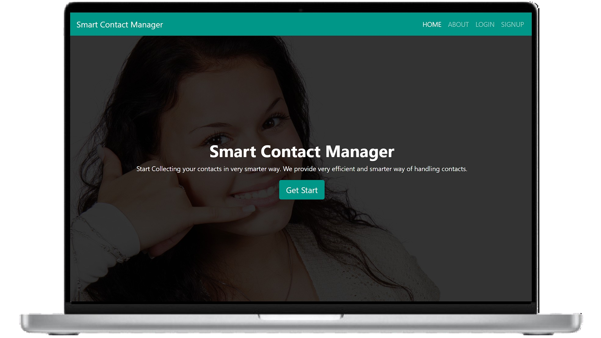

# 📇 Smart Contact Manager

**Smart Contact Manager** – Simplify, secure, and streamline your contact management.

A full-stack web application that allows users to securely store, manage, and access personal contacts. Built using **Spring Boot** for the backend and **React.js** for the frontend, the app features authentication, responsive UI, and complete CRUD operations.

---

## 📸 Demo

  

## 🚀 Features

- 🔐 User Authentication & Authorization
- 📥 Add, Edit, Delete Contacts
- 📱 Responsive UI – mobile & desktop compatible
- 🔄 Real-time UI updates with RESTful APIs
- 💾 Secure contact storage with Spring Boot backend
- 📦 Clean and modular code structure

---

## 🛠️ Tech Stack

| Layer        | Technology      |
|--------------|-----------------|
| Frontend     | React.js        |
| Backend      | Spring Boot     |
| Version Control | Git & GitHub |
| API Style    | REST APIs       |

---

## 🔗 Connect with Me
### Om Prakash Sao
- **Final Year B.Tech CSE | Full Stack Java Developer**
- **📧 saoomprakash2002@gmail.com**
- **🌐 https://www.linkedin.com/in/om-prakash-sao-6bb039240/**

